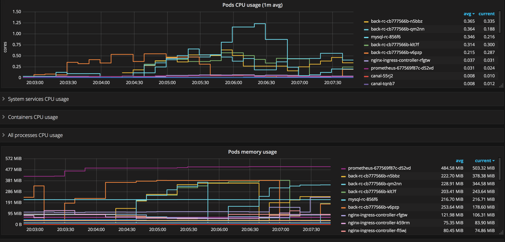

# Report 4

## Requirement 1

### ci/cd平台

- 采用drone搭建ci/cd平台，该工具语法简洁，和travis、gitlab-runner类似，jenkins则过于重量级。
- 首先需要一台服务器运行drone服务，它以容器方式运行，官方也给出了docker-compose示例。
- drone和github搭配是通过github的Oauth application，注册一个新的Oauth app，然后将账号传给drone即可。

### 配置集成项目

- 登陆drone服务，设置hook，让它监听需要持续集成的项目。
- 项目地址：[前端](https://github.com/Veiasai/bookstore_front)，[后端](https://github.com/Veiasai/bookstore_back)。
- 在分支drone-0.8上，根目录下创建.drone.yml文件，按照drone语法配置集成方式，整个过程是以容器运行的，可以利用各大镜像仓库里的镜像去完成工作，比如前端项目通过node镜像编译，nginx镜像部署，后端java项目则用maven镜像编译打包，tomcat镜像部署。

## Requirement 2

### rke部署k8s集群

- 相对来讲，在ubuntu上使用rke要比centOS简单，使用腾讯云的ubuntu 16.04的服务器，没有任何错误，一次成功。
- 在部署配置文件中，开启ingress-addons，则会启动ingress-controller和default-backend，就有了ingress功能，只需要写路由规则即可使用。
- Dashboard下载官方的yaml配置文件，修改镜像为`registry.cn-shenzhen.aliyuncs.com/rancher_cn/kubernetes-dashboard-amd64:v1.8`，则可以正常下载了。
- 访问dashboard则通过不设拦截的proxy，并未配置完善的权限管理。

## Requirement 3

### k8s部署前后端

- drone会将前后端都打包为镜像，并发布到docker hub，在k8s使用只需要写好部署文件即可，见k8s/bookstore目录，数据库则在k8s/mongo和k8s/mysql。

## Requirement 4

### Load Balace

- 在k8s上做LB并不复杂，实际上k8s暴露外部服务的方式只有三种，nodeport，ingress，外部负载均衡器。
- 前端的访问我们直接采用了nodeport，这个其实性能不高，资源损耗很大，但是比较简单，直接从各个ip都可以访问到前端。
- 后端的访问使用ingress-controller，这个可以通过域名转发http请求，详细的见配置文件k8s/bookstore/bookstore-ingress.yml。

### Experiment

- TODO:

## Requirement 5

### Autoscaling

- k8s replica conroller具有auto scalling功能，只需要用kubectl设置一下即可。

### Monitor

- 为了监测集群资源使用，我们安装了grafana和prometheus去监控集群资源使用，这部分的配置文件直接使用官方教程给出的。

#### master/node节点环境部署

以下使用的配置文件均位于文件夹k8s-prometheus-grafana中。  
在master节点按照配置文件进行安装部署，并在node节点通过以下操作下载监控所需镜像。

`docker pull prom/node-exporter`  
`docker pull prom/prometheus:v2.0.0`  
`docker pull grafana/grafana:4.2.0`  

采用daemonset方式部署node-exporter组件

`kubectl create -f  node-exporter.yaml` 

#### 部署prometheus组件

* rbac文件

    `kubectl create -f  k8s-prometheus-grafana/prometheus/rbac-setup.yaml`

* 以configmap的形式管理prometheus组件的配置文件

    `kubectl create -f  k8s-prometheus-grafana/prometheus/configmap.yaml`

* Prometheus deployment 文件

    `kubectl create -f  k8s-prometheus-grafana/prometheus/prometheus.deploy.yml`

* Prometheus service文件

    `kubectl create -f  k8s-prometheus-grafana/prometheus/prometheus.svc.yml`

#### 部署grafana组件

* grafana deployment配置文件

    `kubectl create -f   k8s-prometheus-grafana/grafana/grafana-deploy.yaml`

* grafana service配置文件

    `kubectl create -f   k8s-prometheus-grafana/grafana/grafana-svc.yaml`

* grafana ingress配置文件

    `kubectl create -f   k8s-prometheus-grafana/grafana/grafana-ing.yaml`

##### 配置效果

##### 运行效果

### Autoscaling Experiment

- 运行metrics-server服务，将replica controller替换为deployment，设置cpu资源limit，最后创建hpa资源。
- 程序启动时由于占用了较高cpu资源，会发生一次scale，稳定后将会降回1个pod，然后发起测试请求，观察grafana性能监控曲线。

- 由上图，可以看见。
  - 在3:30开始运行测试，单个pod的cpu使用率开始上升，当达到limit 0.5core时，开始scale。
  - 经过30s，另外三个pod开始调度运行。
  - 三个pod的tomcat应用开始启动，tomcat加载也较慢。
  - 经过30s，tomcat启动完毕。
  - mysql的资源使用率随着pod增加不断上升。
  - 当四个pod同时工作，单个的资源使用率开始下降并趋于稳定(0.25)。

- Autoscaling总耗时约一分钟。
  - 调度反应很快，大约几秒。
  - 容器启动时间在二十秒左右。
  - tomcat启动需要三十秒。

## 参考文件

https://github.com/redhatxl/k8s-prometheus-grafana.git